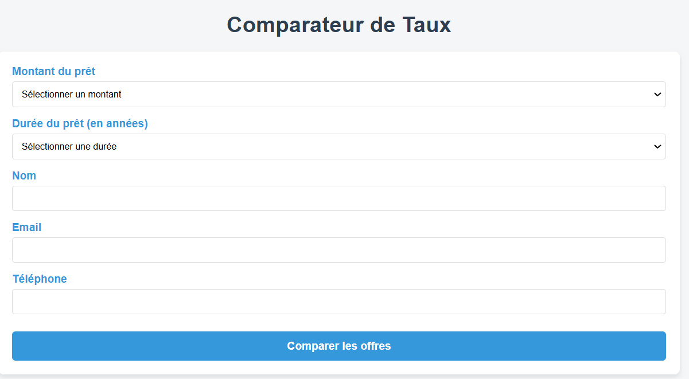
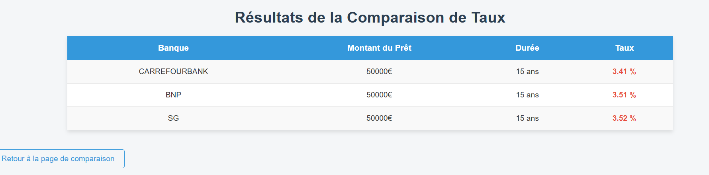

# ** Test technique Développeur PHP - Meilleurtaux 2024 **

# **Features**
- Check validate input phone
- Calculate monthly paid

# **Requirements**
- php8.*

# **SETUP**
#### Get the project :
~~~
    git clone https://github.com/hardinahRG25/MeilleurTauxComparison.git
~~~

#### Setup
~~~
    cd MeilleurTauxComparison
~~~

~~~
    composer install
~~~

#### Run the project
Then simply execute

~~~
    php -S localhost:8000 -t public
~~~

#### Run test unit
~~~
    php bin/phpunit 
~~~

##Test

web : http://localhost:XXXX/compare (XXXX : port) => http://localhost:8000/compare

**DEMO**

**Test routes** 
~~~
    curl -X GET http://localhost/compare
~~~

~~~
    curl -X POST http://localhost/compare \
    -d "loan_amount=100000" \
    -d "loan_duration=20" \
    -d "name=Ra Koto" \
    -d "email=rakoto@gmail.com" \
    -d "phone=+1234567890"
~~~

~~~
    curl -X POST http://localhost/api/compare \
    -H "Content-Type: application/json" \
    -d '{"loan_amount": 100000, "loan_duration": 20}'
~~~

~~~
    curl -X POST http://localhost/api/compare \
    -H "Content-Type: application/json" \
    -d '{"loan_amount": "invalid_value", "loan_duration": 20}'
~~~

# **Credits**
Hardinah RAJAONANIRINA
